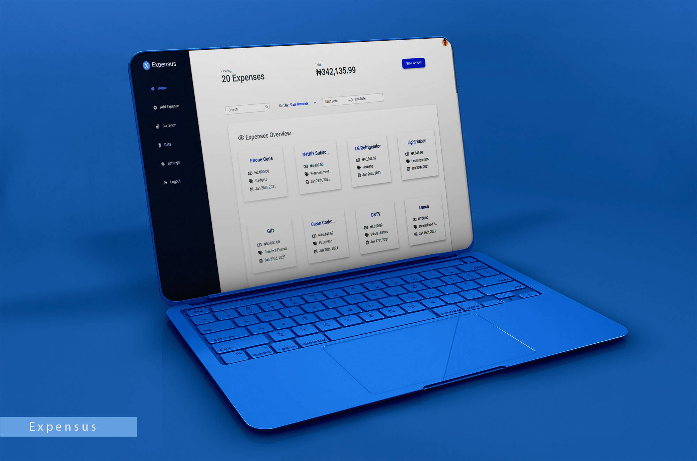

<!-- PROJECT LOGO -->
 

  
  
  <h3 align="center">Expensus</h3>

  

    Expensus is a budget planning application that lets you document the cost incurred in or needed for something in an interactive manner.
     
    <a href="#table-of-contents"><strong>Explore the docs ↓</strong></a>
     
     
    <a href="https://expensus.herokuapp.com" target="_blank">View Demo</a>
    ·
    <a href="https://github.com/olayis/expensus/issues">Report Bug</a>
    ·
    <a href="https://github.com/olayis/expensus/issues">Request Feature</a>
  

<!-- TABLE OF CONTENTS -->

## Table of Contents

- [About the Project](#about-the-project)
  - [Built With](#built-with)
- [Getting Started](#getting-started)
  - [Prerequisites](#prerequisites)
  - [Installation](#installation)
- [Roadmap](#roadmap)
- [Contributing](#contributing)
- [Screenshots](#screenshots)
- [License](#license)
- [Contact](#contact)
- [Dependencies Documentations](#dependencies-documentations)

<!-- ABOUT THE PROJECT -->

## About The Project

### Built With

- Html
- S(CSS)
- JavaScript
- React.js
- Redux
- Firebase

<!-- GETTING STARTED -->

## Getting Started

To get a local copy up and running follow these simple steps.

### Prerequisites

- If you don't already have the following installed on your system, click on the links below to install:

  - Node.js - <https://nodejs.org/en/>
  - yarn - <https://classic.yarnpkg.com/en/docs/install/>

- Firebase and Env Variables

  - Create development/production and test databases on [firebase](https://console.firebase.google.com/) for the application.
  - Create `.env.development` and `.env.test` files in then root directory of the project and add the Firebase SDK snippet config in
    the `Key=Value` format e.g.
     
    `FIREBASE_API_KEY=your api key`
     
    `FIREBASE_AUTH_DOMAIN=your application auth domain`
     
    `FIREBASE_DATABASE_URL=your database url`
     
    `FIREBASE_PROJECT_ID=project id`
     
    `...`

### Installation

1.Clone the expensus repository

    git clone https://github.com/olayis/expensus.git

2.Install all the dependencies of the project

    npm install
    or
    yarn

3.Run webpack development server

    npm run build:dev
    or
    yarn build:dev

    Runs the app in the development mode.

    Open http://localhost:3000 to view it in the browser.

    The page will reload if you make edits.

4.Testing the application

    npm run test
    or
    yarn test

    Launches the test runner.

    npm run test:watch
    or
    yarn test:watch

    Launches the test runner in the interactive watch mode.

5.Run webpack production build

    npm run build:prod
    or
    yarn build:prod

    Runs the app in production mode.

6.Start up server to view app in production mode

    npm run start
    or
    yarn start

    Runs the app in the development mode.

    Open http://localhost:9000 to view it in the browser.

## Roadmap

See the [open issues](https://github.com/olayis/expensus/issues) for a list of proposed features (and known issues).

<!-- CONTRIBUTING -->

## Contributing

Contributions are what make the open source community such an amazing place to be learn, inspire, and create. Any contributions you make are **greatly appreciated**.

1. Fork the Project
2. Create your Feature Branch (`git checkout -b feature/AmazingFeature`)
3. Commit your Changes (`git commit -m 'Add some AmazingFeature'`)
4. Push to the Branch (`git push origin feature/AmazingFeature`)
5. Open a Pull Request

## Screenshots

- Login page

- Dashboard page

- Add Expense page

- Edit Expense page

<!-- LICENSE -->

## License

Distributed under the MIT License. See `LICENSE` for more information.

<!-- CONTACT -->

## Contact

Olayinka Olusegun

- olayinkasegunsolo@gmail.com
- LinkedIn - <https://linkedin.com/in/olusegun-olayinka>
- Twitter - [@olusegun_os](https://twitter.com/olusegun_os)

Project Link: <https://github.com/olayis/expensus>

## Dependencies Documentations

Links to the documentations of some dependencies used in the project are:

- [Babeljs](https://babeljs.io/docs/en/)
- [Enzyme](https://enzymejs.github.io/enzyme/docs/api/)
- [Jest](https://jestjs.io/docs/en/getting-started)
- [Moment](https://momentjs.com/docs/)
- [React-dates](https://github.com/airbnb/react-dates)
- [React-modal](https://www.npmjs.com/package/react-modal#api-documentation)
- [React-router](https://reactrouter.com/web/guides/quick-start)
- [Redux](https://redux.js.org/introduction/getting-started)
- [Webpack](https://webpack.js.org/concepts/)
